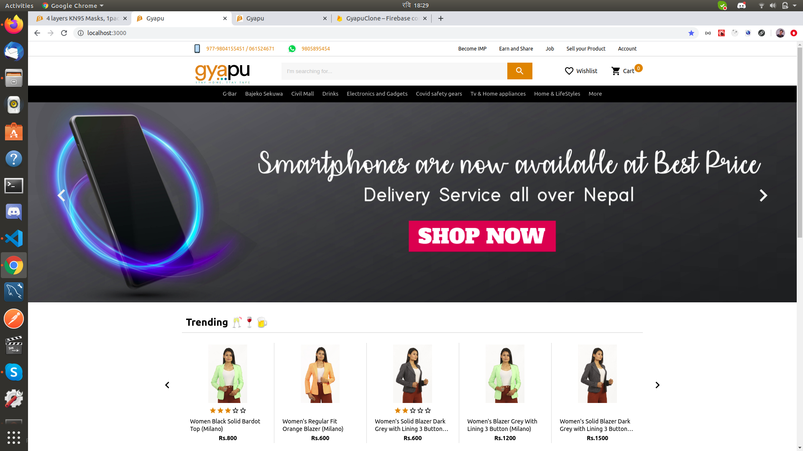
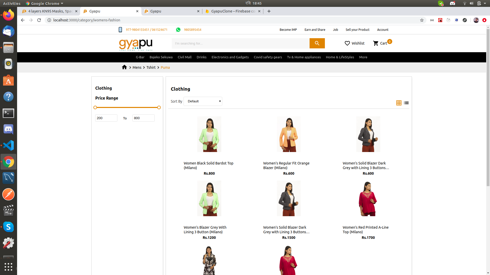
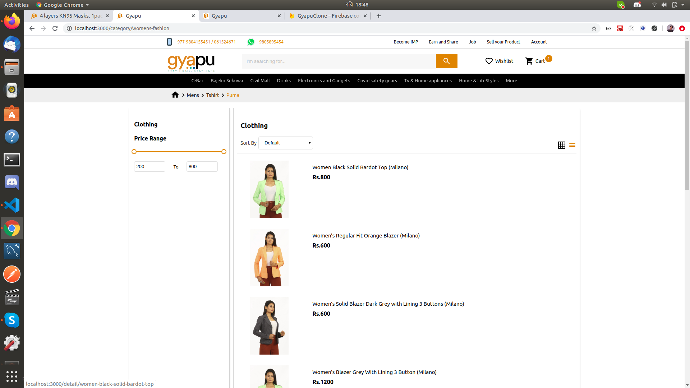
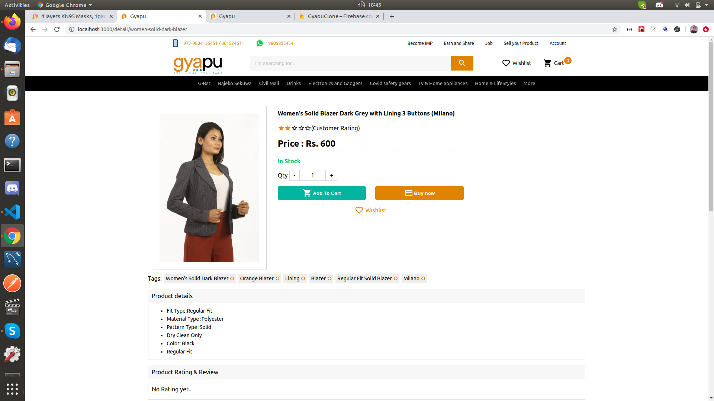
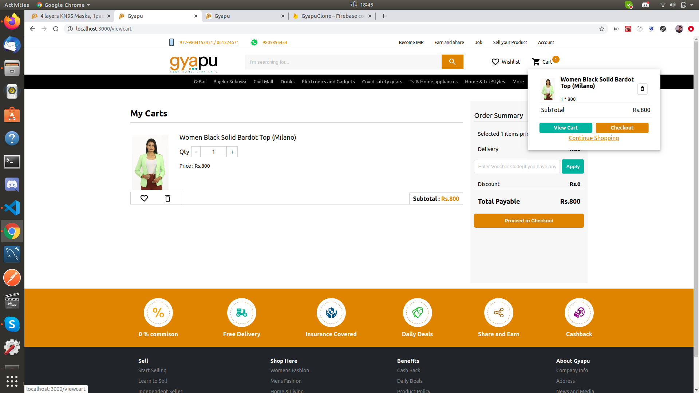

# Introduction

This is a e-commerse template for react which can be really a kickstart if you are willing to do e-commerse related projects.

### ScreenShots
1. ### Home page

2. ### Products page (Grid View)

3. ### Products page (List View)

4. ### Detail page

5. ### Cart page

### Features

1. State Management using React Hooks(without using redux)
2. Custom Route which always make sure your page will not clip when the route is changed
3. Cart Handling
4. Grid/List view of the products
5. Sass implementation
6. Custom Hero sliders,carousel,arrows implemented using react-slick
7. Non-static navbar items (Dynamic navbar contents)

### How to install

1. First clone the project or download the zip and extract somewhere in your workspace
2. Based on the package manager you have (npm or yarn) follow the command below
    For Yarn
    `yarn install`
    
    For npm
    `npm install`
3. Once you are done with step 2, You are ready to go.
4. Enter the following command to start the project

      ### For yarn
      `yarn start`
      
      ### For npm
      
      `npm start`

